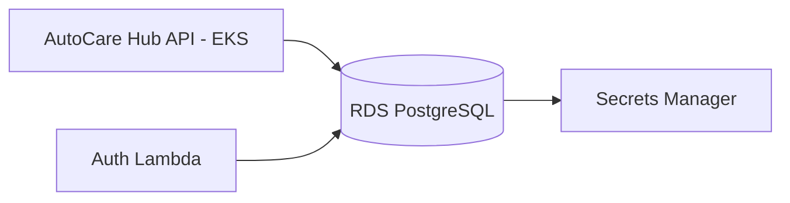

# AutoCare Hub - Infraestrutura Banco

Terraform do banco gerenciado PostgreSQL da fase 3.

## Escopo

- Amazon RDS PostgreSQL 16 em subnets privadas.
- DB subnet group.
- Security Group liberando acesso apenas para security groups da API/EKS e Lambda.
- Secret no AWS Secrets Manager com `host`, `port`, `dbname`, `username` e `password`.
- Storage criptografado, backup, autoscaling de storage e Performance Insights.
- Outputs consumidos pela API, Lambda e infraestrutura Kubernetes.

## Backend remoto do Terraform

O Terraform usa backend S3 com lock em DynamoDB. A pipeline inicializa o backend com secrets do GitHub:

- `TF_STATE_BUCKET`
- `TF_LOCK_TABLE`
- `AWS_REGION`

O state fica em:

```text
autocarehub-db/hml/terraform.tfstate
autocarehub-db/prod/terraform.tfstate
```

## Variaveis obrigatorias

Configure nos GitHub Environments `homolog` e `production`:

- `AWS_ACCESS_KEY_ID`
- `AWS_SECRET_ACCESS_KEY`
- `AWS_REGION`
- `VPC_ID`
- `PRIVATE_SUBNET_IDS_JSON`, exemplo `["subnet-abc","subnet-def"]`
- `ALLOWED_SECURITY_GROUP_IDS_JSON`, exemplo `["sg-api","sg-lambda"]`

## Deploy

```powershell
cd terraform
terraform init `
  -backend-config="bucket=<bucket-state>" `
  -backend-config="key=autocarehub-db/hml/terraform.tfstate" `
  -backend-config="region=<regiao>" `
  -backend-config="dynamodb_table=<tabela-lock>"
terraform plan
terraform apply
```

## Outputs importantes

- `db_endpoint`
- `db_port`
- `db_name`
- `db_secret_arn`
- `db_security_group_id`
- `jdbc_url`

## Modelo relacional

As migrations de referencia estão em `docs/migration`. A aplicação executa Flyway no startup do backend.

## Arquitetura especifica


