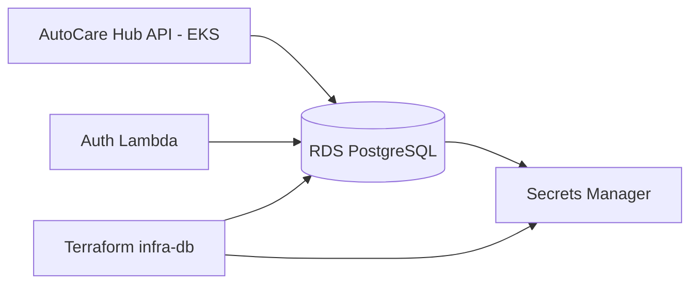

# AutoCare Hub - Infraestrutura Banco

Terraform do banco gerenciado PostgreSQL da Fase 3. Este repositorio provisiona a camada de dados corporativa usada pela API e pela Lambda de autenticacao CPF.

## Papel na Arquitetura

O `infra-db` cria o Amazon RDS PostgreSQL em subnets privadas, publica as credenciais no AWS Secrets Manager e expoe outputs consumidos pelos demais repositorios.



## Escopo

- Amazon RDS PostgreSQL 16.
- Subnet group com subnets privadas.
- Security Group permitindo acesso apenas de SGs autorizados.
- Secrets Manager com `host`, `port`, `dbname`, `username` e `password`.
- Storage criptografado.
- Backup, autoscaling de storage e Performance Insights.
- Outputs para API, Lambda e infra Kubernetes.
- Backend remoto Terraform em S3 com lock em DynamoDB.

## Tecnologias

- Terraform
- AWS Provider
- Amazon RDS PostgreSQL
- AWS Secrets Manager
- AWS S3 remote state
- AWS DynamoDB lock table
- GitHub Actions

## Backend Remoto Terraform

O Terraform usa backend S3 com lock em DynamoDB. A pipeline inicializa o backend com secrets do GitHub:

- `TF_STATE_BUCKET`
- `TF_LOCK_TABLE`
- `AWS_REGION`

State por ambiente:

```text
autocarehub-db/hml/terraform.tfstate
autocarehub-db/prod/terraform.tfstate
```

## Variaveis Obrigatorias

Configure nos GitHub Environments `homolog` e `production`:

- `AWS_ACCESS_KEY_ID`
- `AWS_SECRET_ACCESS_KEY`
- `AWS_REGION`
- `VPC_ID`
- `PRIVATE_SUBNET_IDS_JSON`, exemplo `["subnet-abc","subnet-def"]`
- `ALLOWED_SECURITY_GROUP_IDS_JSON`, exemplo `["sg-api","sg-lambda"]`

## Deploy Manual

```powershell
cd terraform
terraform init `
  -backend-config="bucket=<bucket-state>" `
  -backend-config="key=autocarehub-db/hml/terraform.tfstate" `
  -backend-config="region=<regiao>" `
  -backend-config="dynamodb_table=<tabela-lock>"
terraform plan
terraform apply
```

## CI/CD

- Pull Requests: `terraform fmt`, `terraform init -backend=false`, `terraform validate` e `terraform plan`.
- Branches `homolog` e `main`: `terraform apply` automatico apos validacao.

## Outputs Importantes

- `db_endpoint`
- `db_port`
- `db_name`
- `db_secret_arn`
- `db_security_group_id`
- `jdbc_url`

## Modelo Relacional

A explicacao formal do banco, diagrama ER e indices esta no repo da API:

- https://github.com/yxsbx/SOAT-FIAP-autocare-api/blob/fase-3/docs/database/er-model.md

## Configuracoes Manuais Depois

- Criar bucket S3 de state e tabela DynamoDB de lock antes do primeiro `terraform init` remoto.
- Definir VPC/subnets privadas existentes ou criar uma VPC fora deste repo.
- Informar Security Groups da Lambda e do EKS em `ALLOWED_SECURITY_GROUP_IDS_JSON`.
- Conferir custo, backup retention e Multi-AZ antes de aplicar em producao.

## Links

- Repositorio: https://github.com/yxsbx/SOAT-FIAP-autocare-infra-db
- Documentacao central: https://github.com/yxsbx/SOAT-FIAP-autocare-api/tree/fase-3/docs
