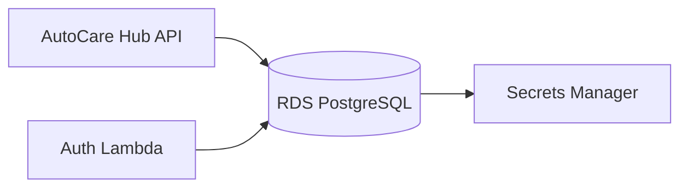

# AutoCare Hub - Infraestrutura Banco

Terraform do banco gerenciado PostgreSQL da fase 3.

## Escopo

- Amazon RDS PostgreSQL
- DB subnet group
- Security Group
- Secret no AWS Secrets Manager
- Backup de 7 dias

## Deploy

```powershell
cd terraform
terraform init
terraform plan
terraform apply
```

## Modelo relacional

As migrations de referencia estao em `docs/migration`.

## Arquitetura especifica


